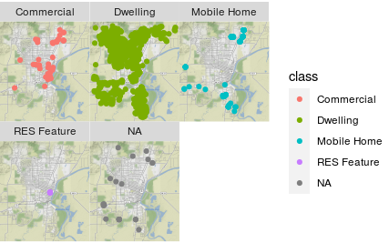

# Geospatial

En esta carpeta se encontrará la vizualización y la estadistica geoespacial

## 1) Visualización geoespacial de datos

Este curso le introducirá en los datos espaciales comenzando con los objetos que ya conoce, los marcos de datos, antes de presentarle los objetos especiales de los paquetes sp y raster utilizados para representar los datos espaciales para el análisis en R. Aprenderá a leer, explorar y manipular estos objetos con la gran recompensa de poder utilizar el paquete tmap para hacer mapas.

¿Dónde debería comprar una casa para obtener el máximo valor por su dinero? Su primer paso podría ser hacer un mapa, pero el análisis espacial en R puede ser intimidante debido a los complicados objetos en los que a menudo viven los datos.

Al final del curso habrás hecho mapas de las ventas de propiedades en una pequeña ciudad, de las poblaciones de los países del mundo, de la distribución de la gente en el noreste de los EE.UU., y de la renta media en los barrios de la ciudad de Nueva York.

### a) Capítulo 1: Mapas básicos con ggplot2 y ggmap

Nos sumergiremos en la visualización de algunos datos espaciales; las ventas de propiedades en una pequeña ciudad de Estados Unidos, utilizando ggplot2 y le presentaremos el paquete ggmap como una forma rápida de añadir contexto espacial a sus gráficos. Hablaremos de lo que hace que los datos espaciales sean especiales y le presentaremos los tipos comunes de datos espaciales con los que trabajaremos a lo largo del curso.

## 2) Estadística geoespacial
